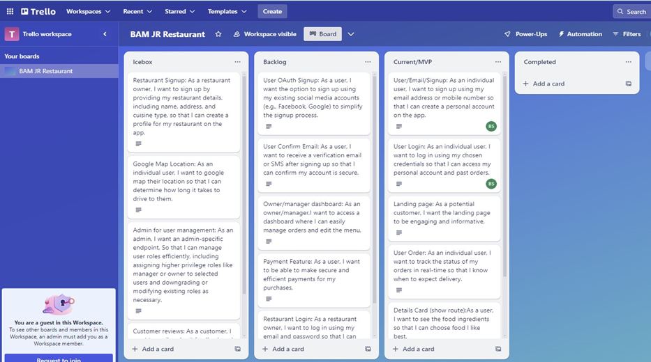
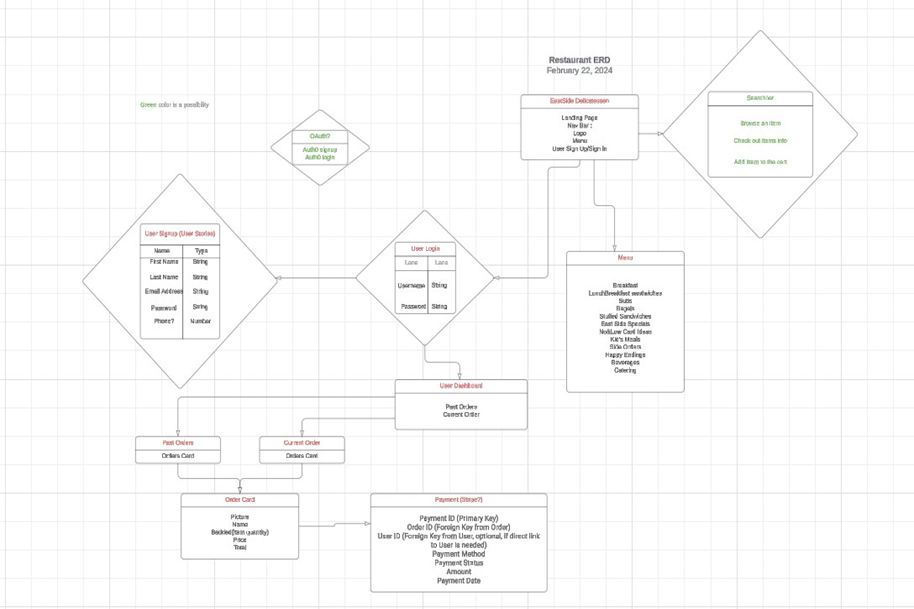
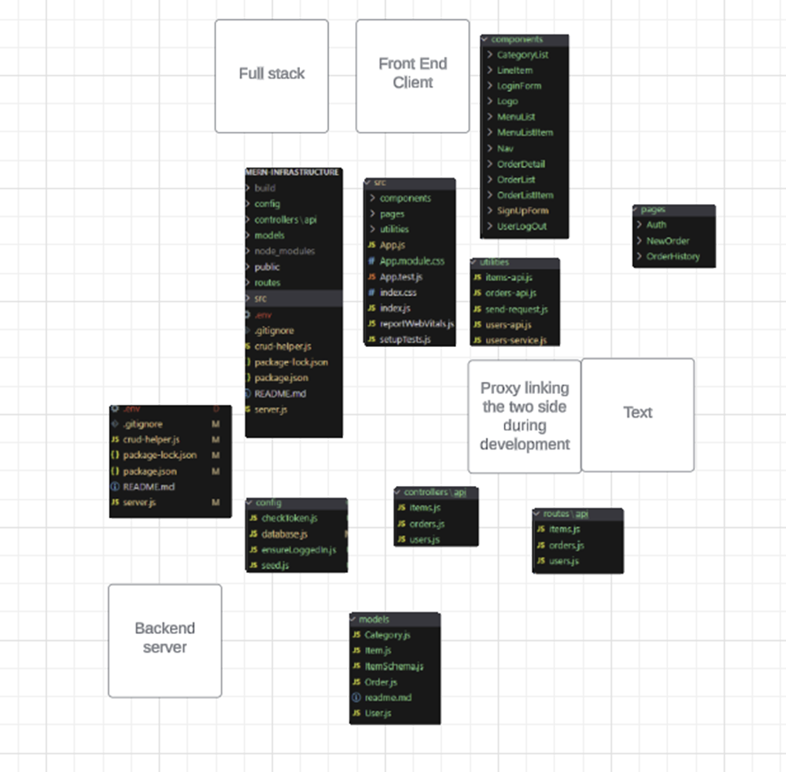
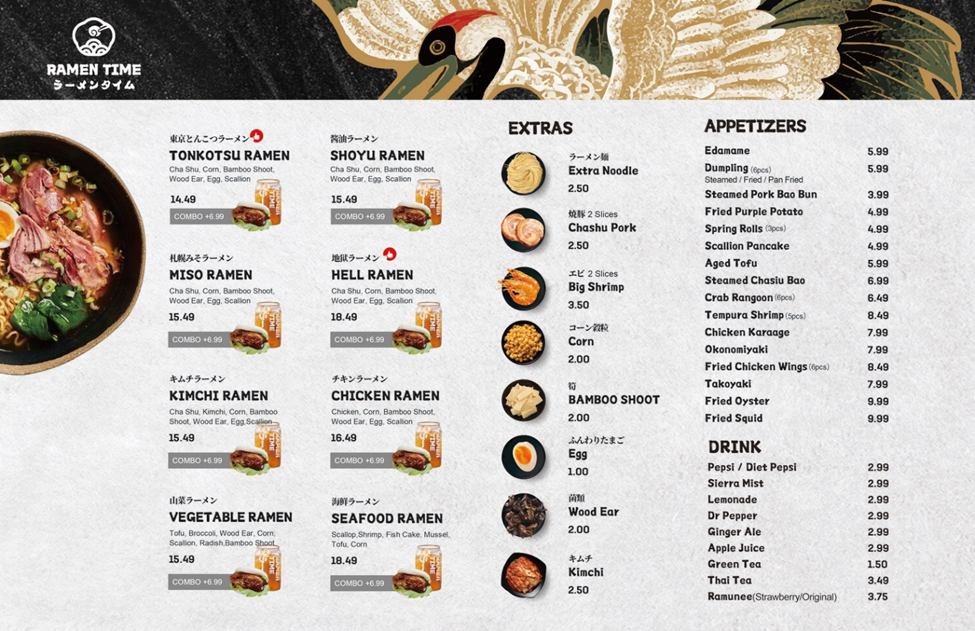
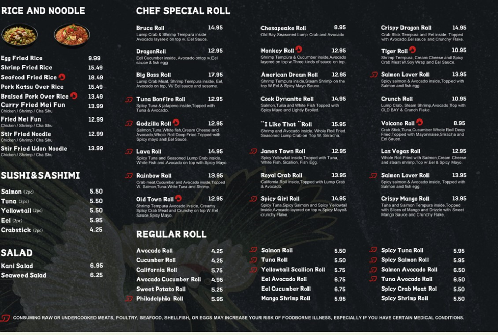
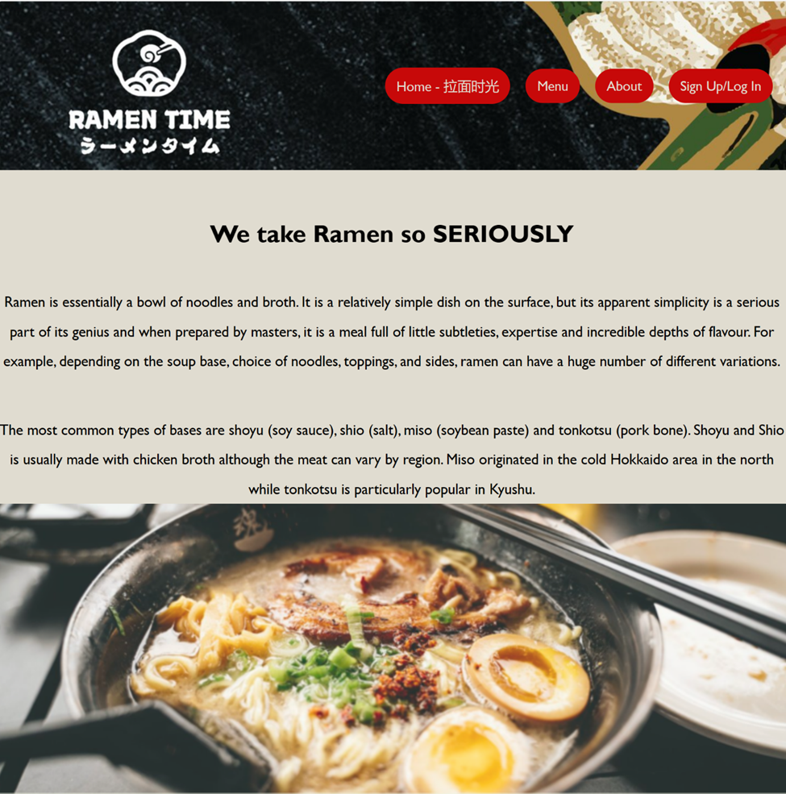
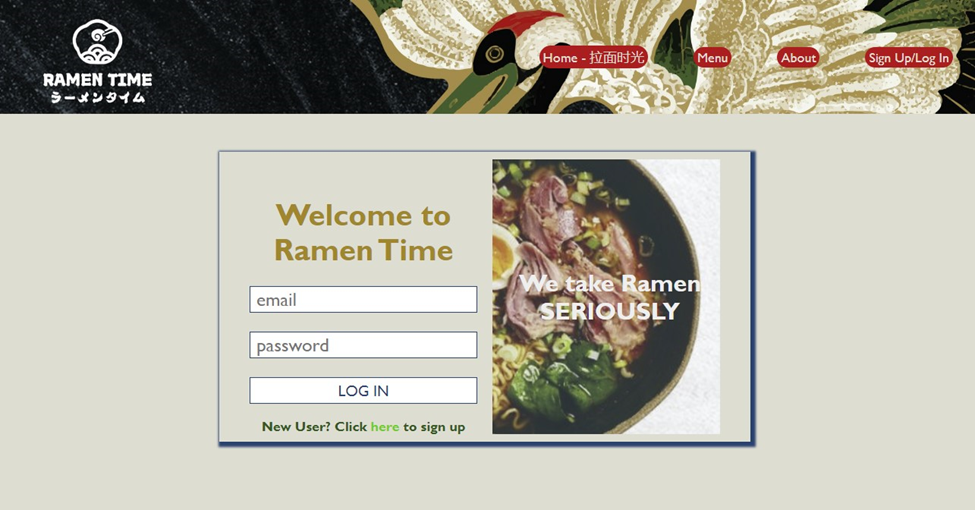
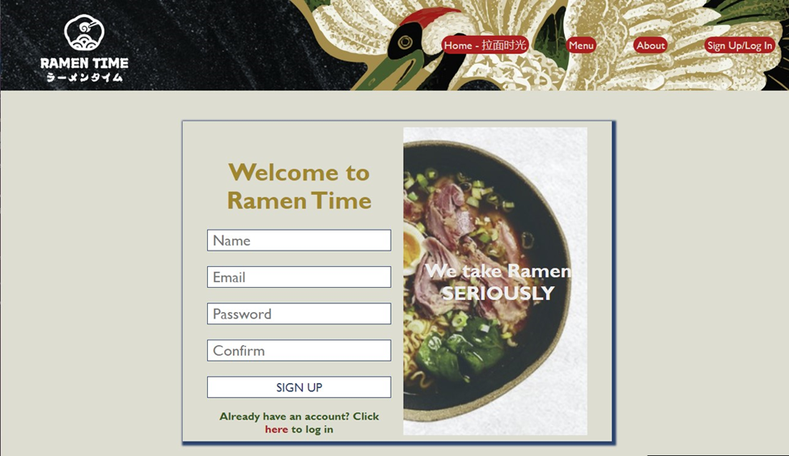
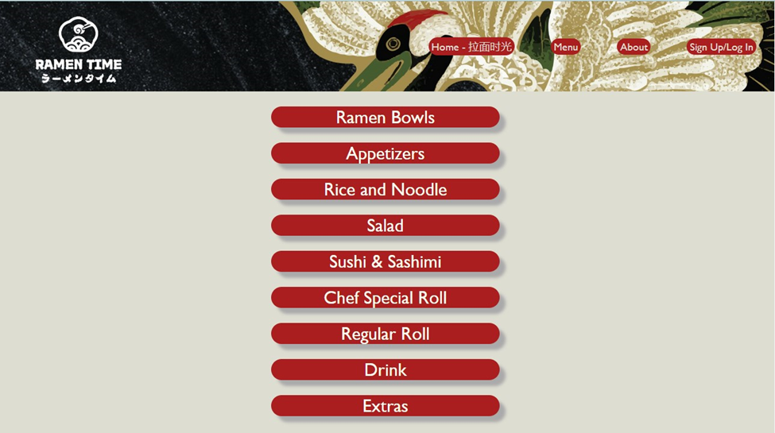
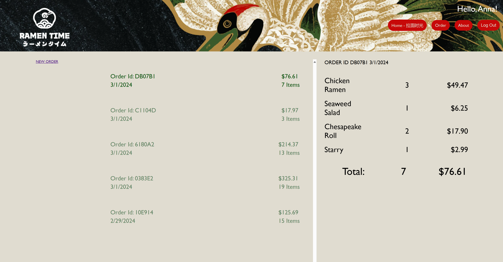

# BAM JR RAMEN TIME

Welcome to the inaugural project by **BAM JR Development** – a vibrant and innovative team consisting of Brianna, Anna, Mishelle, Juan, and Ran. We are thrilled to be embarking on a transformative journey, where our passion for technology and creativity culminates in the development of a fully functional restaurant website.

## Vision

As a cohesive team, we are dedicated to revamping our client's restaurant website, not just to elevate its aesthetic appeal but to incorporate a suite of essential features that cater to the modern-day restaurant patrons and managers. We understand the critical role of technology in the culinary experience and are committed to crafting a platform that is both intuitive and comprehensive.

## Project Overview

Our project encompasses a complete overhaul of the existing website, which is a static webpage, and introduces a range of functionalities:

### Customer’s Experiences

- As a user, I want to be able to browse the website on various devices with the same quality of experiences.
- As a user, I want to sign up using my email address or mobile number so that I can create a personal account on the app.
- As a user, I want to log in using my chosen credentials so that I can access my personal account and past orders.
- As a user, I want the landing page to be engaging and informative.
- As a user, I want to track the status of my orders in real-time so that I know when to expect delivery.
- As a user, I want to see the food ingredients so that I can choose food I like best.
- As a user, I want to browse the menu so that I can order the meal of my choice.
- As a user, I want seamless and secure transactions with multiple payment options, ensuring convenience and safety for all users.

### Admin Experiences

- As a manager, I want to easily update the menu and item prices, so that they reflect current offerings and market prices.
- As a manager, I want to view all incoming orders in real-time, so that I can manage kitchen workflow and ensure timely delivery.
- As a manager, I want to access customer data and order history, so that I can create targeted promotions and improve customer satisfaction.
- As a manager, I want to generate reports on sales, popular items, and customer feedback, so that I can make informed decisions about the business.

## Meet the Software Engineering Team

1. Brianna Steele
2. Anna Bowen
3. Mishelle Esser
4. Juan Liu
5. Ran Tu

## Background

The BAM JR Ramen Time project was initiated by a group of Per Scholas WISE (Women in Software Engineering) fellows, who want to hone in their software engineering skills while making a meaningful contribution to their community. This endeavor was accomplished through a process that closely mirrored agile methodology, emphasizing collaboration among peers and stakeholders.

This approach provided a dynamic and responsive development environment, allowing the team to efficiently address changes and incorporate feedback throughout the project lifecycle. The project not only served as a platform for technical skill enhancement but also fostered a sense of community and teamwork among all the team members, demonstrating the powerful impact of combining learning with practical application in a supportive environment.

For inquiries or further information, please contact us at BAM JR Development – bristeele99@gmail.com, anna.bowen16@gmail.com, essermishelle@gmail.com, liujuan0616@gmail.com, ran.turx2@gmail.com

## Technologies Used
HTML | CSS | JavaScript | MongoDB | Express | React | Node.| Mongoose | Bcrypt | JSON Webtoken | 
## Getting Started
Click here to launch the app: 

In Ramen Time, you can sign up or login as a new user. You can also login or sign up as an administrator for the restaurant. Use the navigation bar to see the home page, the about page, and the menu with all of our food category options. Scroll through each category to see each food time. Sign up or login to start your new order. Add the meals of your choice to your order and select the quantity of each meal. Checkout your order and wait for your food! Administrators can navigate to their own dashboard with their a selection of action items. You can logout when you are finished.
## Trello Board, ERD Dataflow and Schema Diagrams
 
 
 

 Current Existing Static Website (No User Interface)
 
 
 
  BAM JR Landing Page
 
 Sign Up & Login Page
 
 
 Menu Category
 
 New Order Page
.png>)
 Order History Page
 

Admin Dashboard

Payments
OAuth